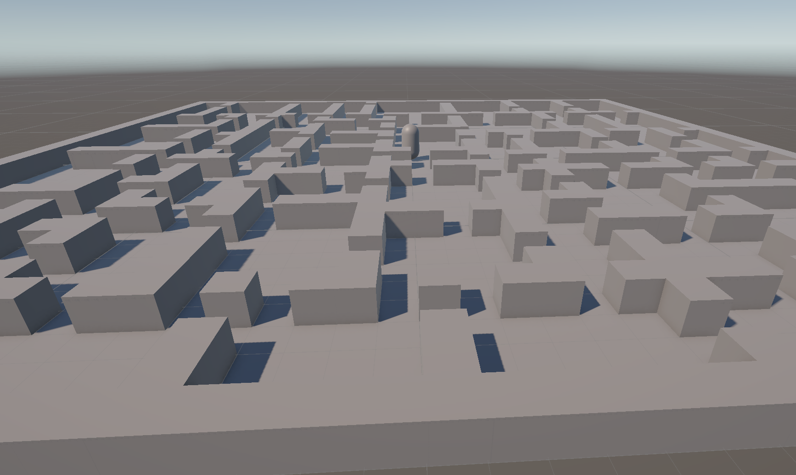
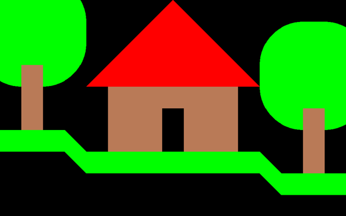
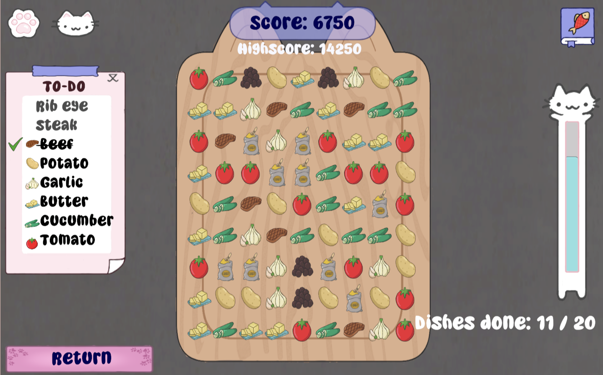

# PlayerUnknownProductions Portfolio
This is a version of my portfolio tailored to PlayerUnknownProductions. These are the projects on my portfolio that are relevant to the hiring team of PlayerUnknownProductions.

# Dungeon Generator
Procudural generation. School project.

[Read the full devlog →](../Projects/DungeonGenerator1.md)

Procedural Generation using delauney triangulation, voronoi, pathfinding and mesh generation. Passion project using AI.

[Read the full devlog →](../Projects/DungeonGenerator2.md)

# C++ project Escape the matrix

For the intake project at buas I needed to make a game using a template buas made available in C++. The idea is to make a game in C++ without using a conventional game engine. I made a game inspired by breakout, but with weird shapes instead of blocks.

[Read the full devlog →](../Projects/BreakTheMatrix.md)

# Cat Media and Gourmet Technologies
This Is the best game i colaborated on. It's a cooking game where you add ingredients to the dish using a match-3 puzzle mechanic. As a team we have received a lot of positive feedback. I made the swiping detection and 3 in a row detection and resolution algorithm.

[Read the full devlog →](../Projects/CatMediaAndGourmetTechnologies.md)

# Art project 2
This is a Schoolproject where i made a 3D model of a gym. The objective is to use tilable textures and texture atlases to make kit to make the building. We also got a client brief and a lore guide. I started by searching for reference images and grayboxing.

# Modding projects

