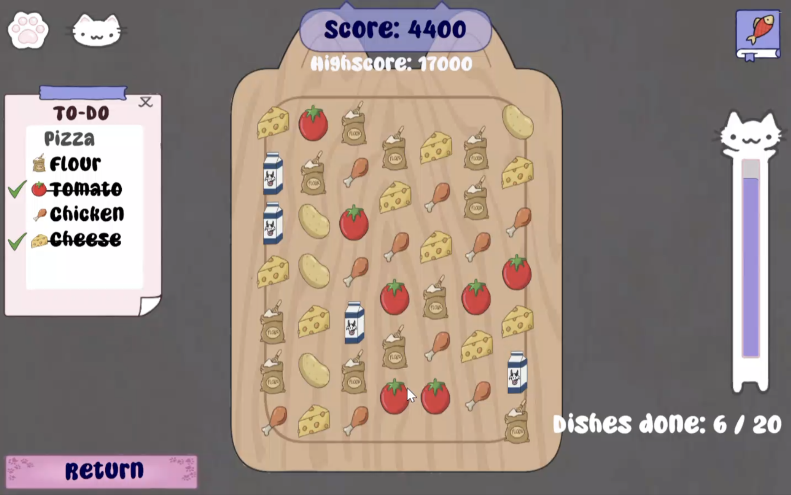

#Group project: Cat Media and Gourmet Technologies.  

This Is the best game i colaborated on. It's a cooking game where you add ingredients to the dish using a match-3 puzzle mechanic. By swiping you can swap ingredients in a grid to make a line of 3 of the same ingredient. This adds the ingredient to the dish. Keep matching untill the dish is complete. If you accedentally match the wrong ingredient the dish will disapoint the customer, which lowers youor score. If you max out your score you win the game. We decided to theme the game around cats. The costomers are cat versions of our teachers.

For this project i worked on a lot of things, but the largest thing i worked on is the system that detects when the player swipes and what should happen because of it. My first attempt was very messy, so i reworked the whole system. When ingredients fall down, they can combine with other ingredients starting a chain reaction. for The first implementation i didn't take that into account and tried adding it on to the existing system at the end, by calling the method recursively. The problem was that the system was designed to handle one match at a time, so while looping through the grid looking for matches, it would find a match and make blocks fall, messing up all the scanning that had been done. i had also not made a clear separation between methods that collect information and methods that do stuff. This made it realy hard to reuse these methods. The new system was designed as a loop, where all matches are found, all matches are handled all at once, blocks fall and back to the start of the loop.

To detect the matches i made a method that detects for a certain cell if it's part of a match. This way i can loop through the cells the player swiped to check if any match was made. If there is no match the ingredient moves back. If there is a match, i check those cells again and add all of the ingredients part of a match to a hashset. The nice thing about a hashset is that you can only add a cell once, so if there are 4 ingredients in a row, the system will add 6 cells to the hashset of which only 4 are kept. This system greatly simplifies the >3 in a row detection compared to the old system. To find out what score to give to the player i could simply test the size of the hashset and convert that to points.

I then move the ingredients above it down. I used a trick here, where instead of removing the ingredients and then making blocks fall I decided to first switch blocks around so the ingredients to be removed end up at the top, then remove them. This way I could have one method to switch two blocks, animate that, and have the swiping and falling use the same system. the items to be removed are made invisible while they move up, so the player only sees the blocks that move down. To make this work the ingredients need to switch in the right order. I decided to sort the ingredients by column into a dictionary, so i could loop through the items in each column and move them all. The trick here is to first move the highest ingredient up, then the second highest etc. You keep moving them all up untill the highest one can't go any higher.

Once all the ingredients have moved up they get destroyed and replaced. the grid now has a lot of possible matches. To deal with those i loop through the cells in the columns that have moved and call the method from earlyer that tests if there is a match anywhere and the other method that finds all the ingredients to be removed and adds them to the cleared hashset. then moves everything down and scans again over and over untill there are no matches left.
