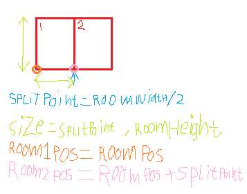
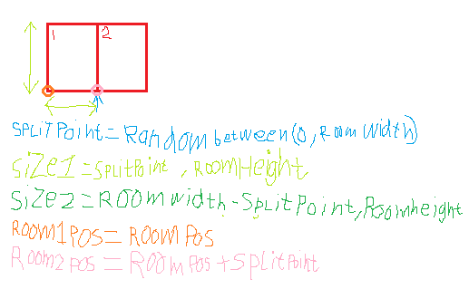
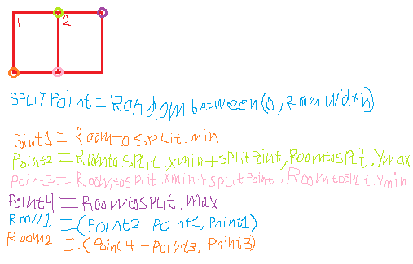
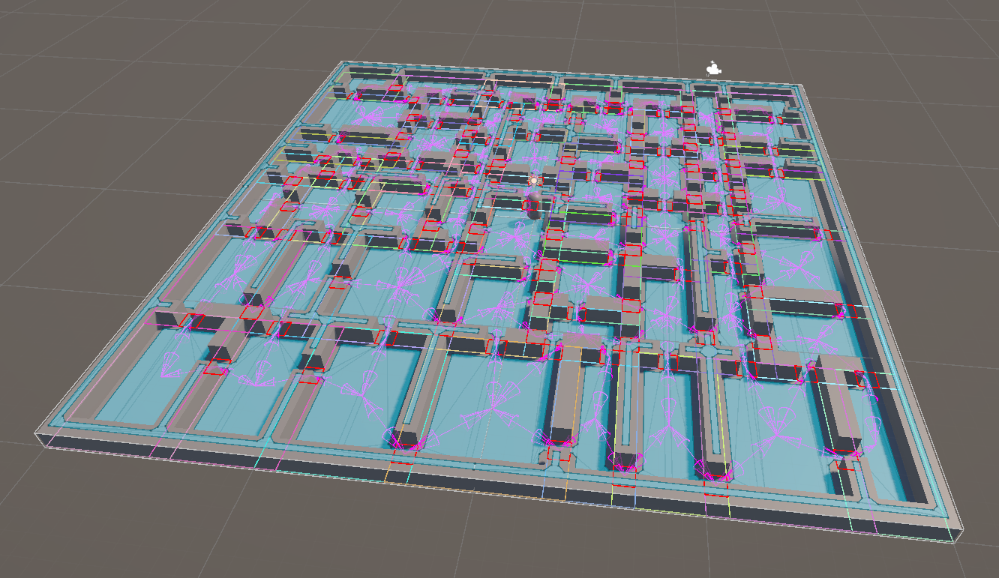

# Dungeon Generator using room subdivision
This is a project i did for my algorithms course. The goal is to make a dungeon generator using the binary partition algorithm.

The idea of this algorithm is to diffine a rectangular area and repeatedly divide it until the rooms are small enough. This creates a space that looks a bit like a mondrian painting. This algorithm can be used to create a dungeon by adding walls where the lines are.

# Start
I started by creating a list of type RectInt. This is a datastructure that was provided to us. you can represent an axis aligned room using two vectors. One for the top left corner and one for the bottom right corner. The RectInt datastructure is really just a class that contains two integer vectors and a few extra methods. This way each RectInt in my list represents a room. I decided to use a list so i could add and remove rooms efficiently.

# Debug visualization
To display these rooms we got a special script that uses Unity's OnDrawGizmo system. This script has a method that can draw the RectInt as a gizmo for the next frame. By calling this method in Update for all rooms in the list it is easy to draw all rooms in the list. This makes it easy to see what's happening. To separate the rooms more clearly i gave each room a different color. I didn't want the color to be randomly generated every frame, because then it looks like a crazy disco show. My solution was to keep a list of colors in the class. Every time a room is added to the room list a random color is also added to the color list. In the update method where i loop through the rooms using a for loop to acces the indexes i also use that index to acces the color from the color list. this gives every room a different color, without the colors changing every frame.

# Splitting
I then made a method called SplitRoomsHorizontal, which takes a given room in the list and splits it into two rooms, removing the origional room from the list and adding the two new rooms to the list. First i made it split vertically down the middle. For each room i calculated the size and the position. Here is a sketch i made at the time to visualize the solution for myself.

I then added randomness. Here i needed to calculate the size of the second room seperately.

The math calculating the rectangles got a bit messy, so i added a method that creates a room from two Vector2Ints. This meant that i only needed to call this method for both new rooms using four corner points in total. Two of those corner points were freebies, because they are already in the origional rectangle. The other two points could be calculated using the split value for X and the top and bottom corner points for Y. This splits the room vertically.

I then copied this method and turned it into a vertical split version. I made the split value random using unity's built in randomization system instead of using half the width or height. Once i had this working i made a method called SplitRoom that calls either method randomly. Starting the list with one room and repeatedly calling Split room generates a bunch of rooms.

Next i added some safety mechanisms, to prevent rooms from getting too small. This was easy to check with just an if statement. If the room is too small the method returns early returning false, whether if it's not too small the normal logic is followed and the method returns false. In the method that randomizes whether to split horizontally or vertically it get this boolean returned, which is used to activate the other method. This means that of a room is too small to be split horizontally, but can be split vertically the system will first randomize which way to split and if it tries to split horizontally it will try to split vertically instead. If this also fails it means that the room is simply too small to be split at all. In this case the split rooms method returns false. This is usefull later for figuring out when to stop trying to split rooms.

# Looping
I then added a for loop that repeatedly calls the split rooms method. I need it to keep splititng untill all rooms are small enough. I track of the number of completed rooms using the return of the split room method to update an integer. Once the number of completed rooms is larger or equal to the total number of rooms all rooms must be complete, which breaks out of the loop. This is how i generate the room data, which is visualized below.

The next step is generating the positions of the doors. Rooms next to eachother should be connected with a door. the door can be between 1 and 3 spaces wide. Doors can not go in corner spaces. I started by making another list of RectInts to store the positions of the doors.

I made a function called MakeDoor. The function requires an area as a RectInt. It makes a door in a random place with a random size and adds it to the doors list. I made another function called GenerateDoorData, which calls this function for every wall section where a door can be placed. To find these wall sections i made a nested loop, looping through every pair of rooms. I then called an algorithm that was provided to us that requires two area and returns the area that overlaps. The result of this method can be fed straight into the MakeDoor method. This succesfully places doors everywhere. In the picture below the doors are displayed in red.

# Graph
Another important part of the exercise is to make a graph out of the dungeon. Every node represents a room, and every edge represents a door. To verify that the graph is made prperly we used breath first search to find all the rooms. In the bootcamp lessons we already got a nice wrapper class that we completed and tested during the lesson. I took that script and put it into my project and connected thing up. I had a list of every room and every door, so i added nodes for every room and an edge for every door. To connect them i used teh intersect method again for all rooms and doors to find out which rooms belong to what doors. In hind sight i could have done this better by generating this data as i was generating the doors themselves. I then ran BFS from the first node to test if every room in the graph is connected.

In the visualization below, the magenta arrows show the room node as their starting point and the door edge as the destination node.

# Spawning assets

