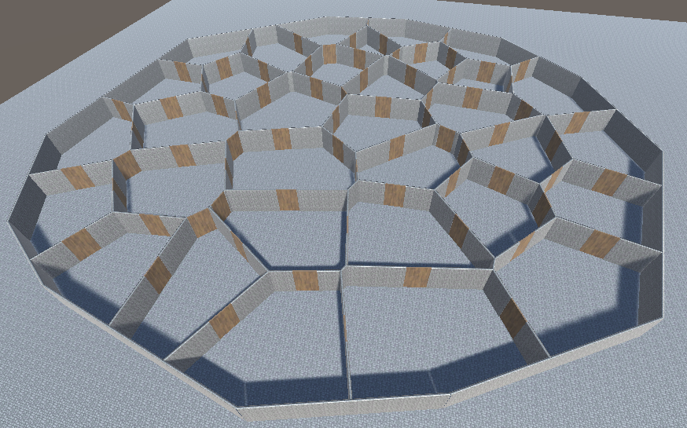
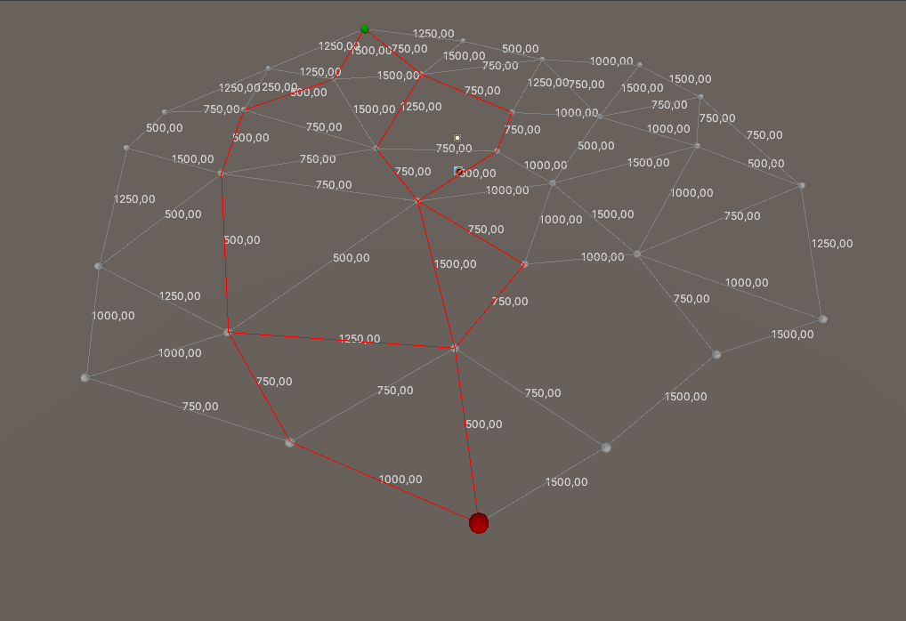
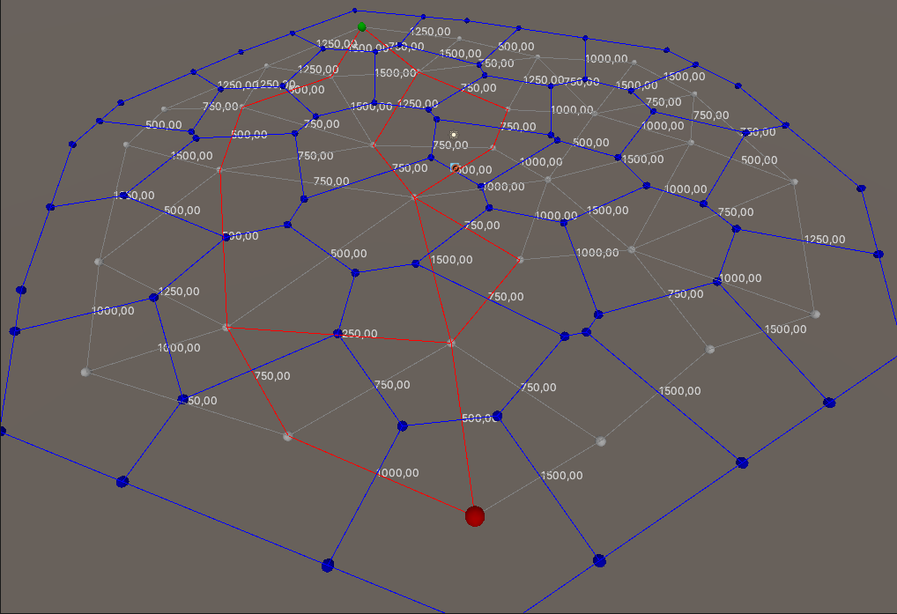

# Dungeon generator using Delauney triangulation and Voronoi
This is a project i did durring the summer holiday. I made a dungeon generator that creates rooms with non-rectangular shapes. This is part of a larger project to make a COD-zombies style game using procedural generation. Since i was doing this project mostly for fun i decided to use AI to write most of my code, but i made sure to understand what each part of the code does. In this project i combined a lot of smaller algorithms to make one larger algorithm that generates the dungeon following certain rules.

I started by picking a bunch of random points. i then connected these points to make a graph. the idea was that to then run a pathfinding algorithm on that graph, to test if it fulfills the given criteria. each node will represent a room and each edge between two nodes represents a door that connects the rooms. The weights of the edges represents the cost to open the door. these weights are randomly generated out of an array of round numbers before the graph is tested.

If the test returns true the graph is used to generate the dungeon. If the test returns false, the waits of the graph are regenerated and the graph is tested agian. If after 50 tries no solution has been found the structure of the graph is asumed to be bad, and a new graph is generated from scratch.

To generate the graph my first attemp was to connect points that are close enough. this created a messy result which a seperate de-messifying algorithm needed to clean up. This still resulted in mostly messy graphs, which i didn't notice at first because of survivorship bias. When i started profiling i realized that the testing stage required way more testing than it was supposed to, even with generous requirements. I then decided to use a triangulation algorithm instead. I first tried the ear removal algorithm, because i had used it before for school. this resulted in better graphs, but it was generating a lot of irregular triangles. Through some research on different triangulation algorithms i found the delauney algorithm which did exactly what i wanted, and can also be used to make a voronoi graph, which would be usefull later.

In Zombies there is usually a room where the player starts and a room with a power switch, which the player must reach to unlock important powerups. there are usually multiple paths from the starting room to the powerroom, where the cost of all the doors adds up to the same number, and there cannot be a cheaper path. I wanted this mehanic in my dungeon generator too. To do this in my graph i choose a starting node and an end node that are far away from eachother. i then run The pathfinding algorithm, which needs to find the N shortest paths which need to be at least L long. If the algorithm finds those paths the graph is valid.

At first, I used Yen’s algorithm to compute the K shortest simple paths. While Yen’s algorithm works well in many scenarios, it Wasn't consistent. Yen’s method is designed to find the shortest path, then the next shortest, and so on, until K paths have been found. This is ideal when path lengths differ, but it doesn’t handle equal‑cost shortest paths in a controlled way. The core issue is that Yen’s algorithm repeatedly calls Dijkstra’s algorithm. Standard Dijkstra keeps only one best distance path per node. If two different paths reach the same node with exactly the same total cost, Dijkstra keeps whichever one it encounters first and discards the other. Because Yen’s algorithm depends on Dijkstra internally, this behavior of equal‑cost shortest paths being lost carries over. In some special graph structures Yen may still return multiple equal‑cost paths, but this is incidental and not guaranteed. For my use case where different cost paths are irrelevant, this inconsistency was a problem.

To solve this, I designed an algorithm designed specifically for equal‑cost shortest paths. It starts with a modified version of Dijkstra’s algorithm. Whenever the algorithm discovers a new path to a node with the same total cost as the current best distance, it keeps the new predecessor instead of discarding it. This produces a graph made out of directional edges pointing from the starting node to the end node where each node may have multiple predecessors. Once Dijkstra finishes, I run a depth‑first search on this new graph, starting from the target node and walking backward through all predecessor links. When it finds a node that has multiple predecesors, both paths are explored and all results are saved in a list of shortest paths. I can stop the enumeration once I have found K paths, this saves performance, by ending the algorithm early and avoids a possible run away effect. This approach guarantees that if K equal cost shortest paths exist, the algorithm will find them, and it avoids the limitations of Yen’s algorithm in graphs with many ties. The speed of the whole algorithm improved from taking 4 minutes to o.o4 seconds. This improvement came mostly from greatly improved relyability.

The delauney algorithm generates a set of triangles by generating a bunch of circles that lie on the nodes. only the circles that don't contain a node inside the circle are kept. If you connect the nodes of those circles you end up with a triangulation fo the points. Now, if you connect the centerpoints of the circles with eachother only if the triangles border eachother, you end up with a voronoi graph, which is exactly what i want to generate the walls of the dungeon.

there are still some problems with this graph though. first of all, a proper voronoi graph has lines on the outside that infinitely extend. this algorithm doesn't generate those lines, because there are no triangles there that border eachother, so i had to fix that. then, i didn't want the dungeon to end up with infinite lines, so i needed a boundary around the whole dungeon. i did this by calculating a convex hull from the initial points and then offsetting that hull to create a boundary around the dungeon. i then used this boundary to limit the lines to the intersection point between the line and the border. Another problem is that the triangles created by the voronoi graph can end up partially outside the hull. To solve this i decided to move those points along the axis of the line towards the middle, by interpolating between the center of the circle and the center of the triangle. Another problem that came up was that some edges were too short to fit a door. i solved this by deleting the corresponding connection in the delauney graph, so the door never get's generated, and the pathfinding algorithm doesn't assume that there is a door.

Once i had the voronoi graph the way i wanted i added a mesh generation system to turn the graph into a mesh. I used a mesh generation script i got from school which turns a list of nodes and faces into a mesh object, which can be sent to meshrenderer and mesh collider components. to generate the nodes and triangles i made a script that uses the graphgeneration data to loop through the voronoi edges, to create walls. the edges are offset to create a wall with thickness and cut in three parts to leave an open space for a door.

