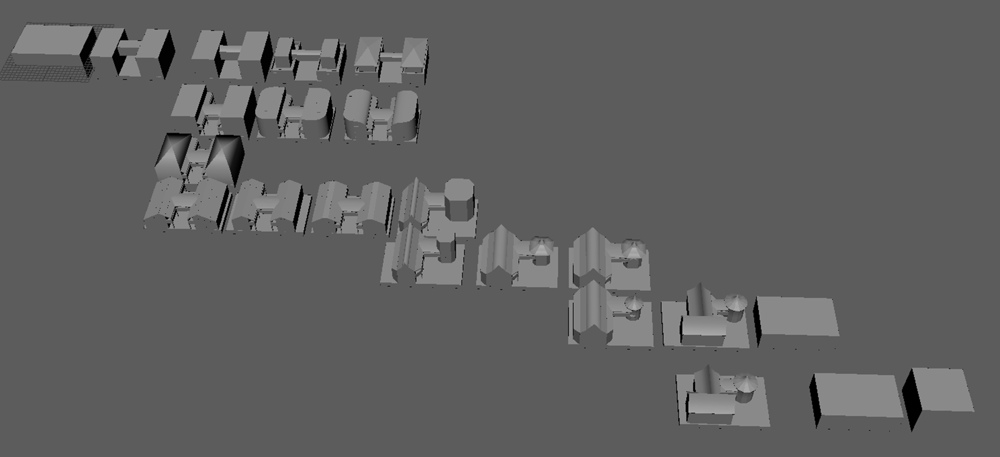
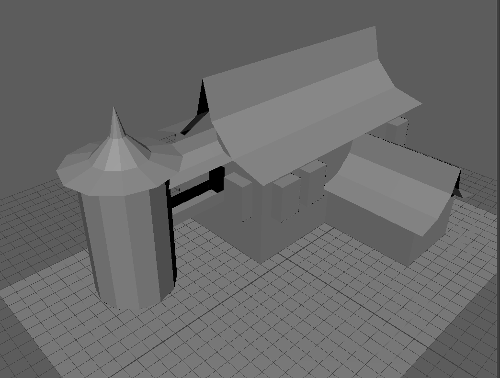
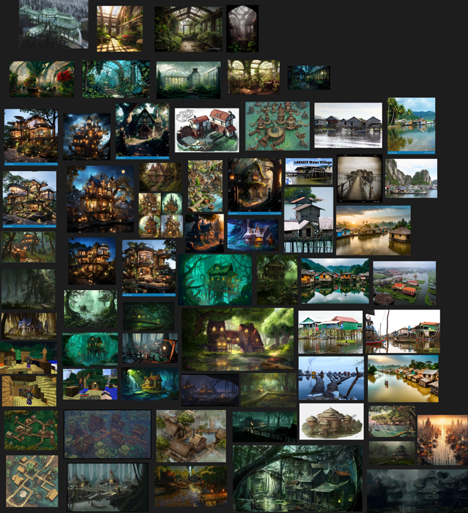
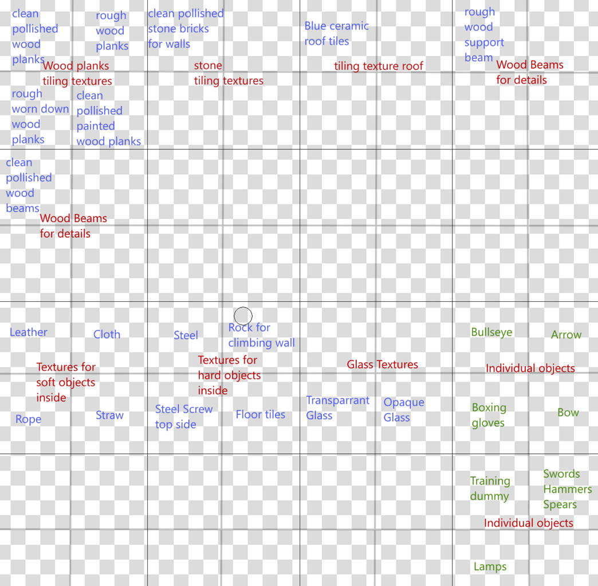
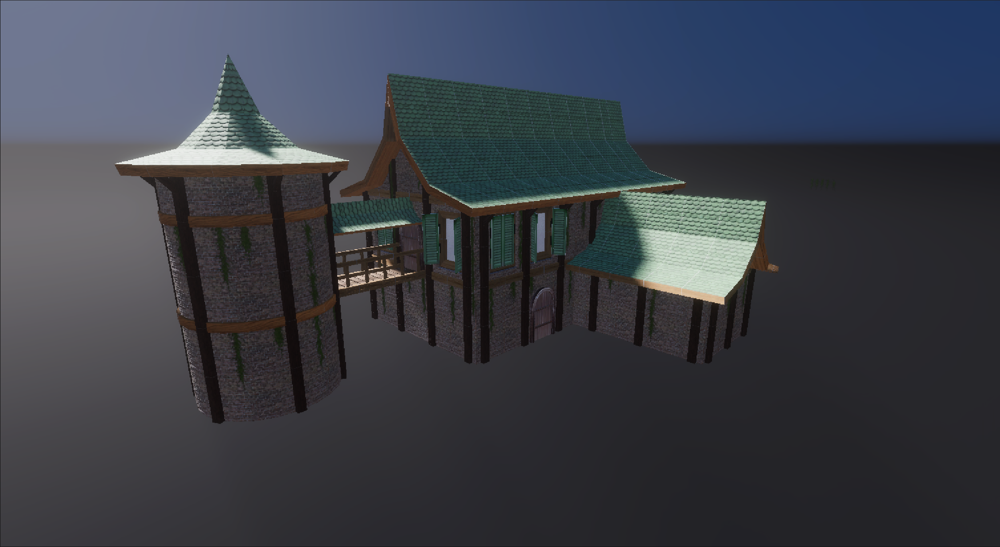

# Anvironment Art project
This is a Schoolproject where i made a 3D model of a gym. The objective is to use tilable textures and texture atlases to make kit to make the building. We also got a client brief and a lore guide. I started by searching for reference images and grayboxing.

Here is the grayboxing i did for this project. i decided to do it in Blender instead of Maya because i had a problem with my Maya license. I started with simple shapes and added more shapes to it. i kept copying the work for every step instead of iterating in the same place, so i could keep track of my older versions. I started in the top left and i copied to the right. If i wanted to try something else i went back to an older version and copied down. This creates a nice branching version history. On the right you can see blocks that represent the dimensions of the building that i could work with.

Once i had access to Maya i used maya's grid system to experiment with exact dimensions.

I also made a textureplan and a kit layout plan.

Here is A showcase of the kit i made.

I used this kit to make the outside of the building.

