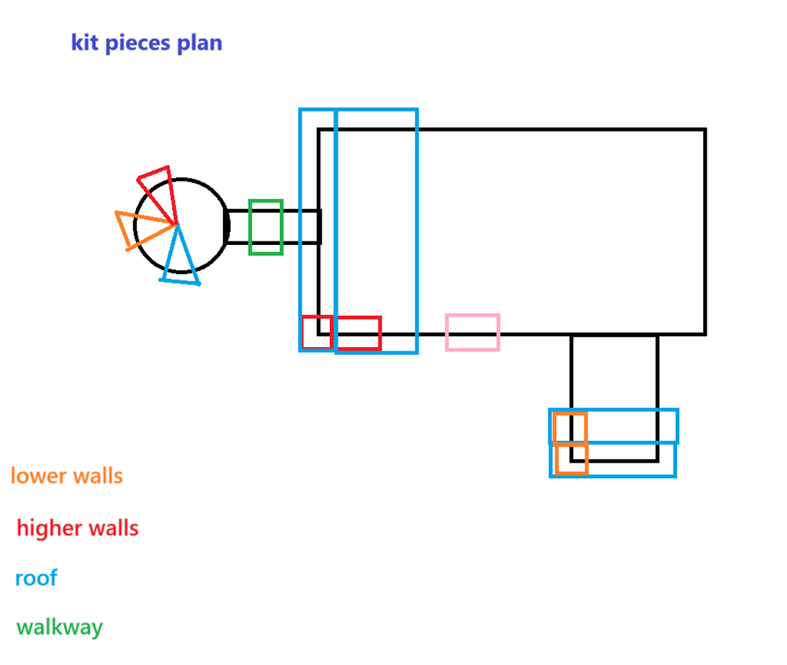
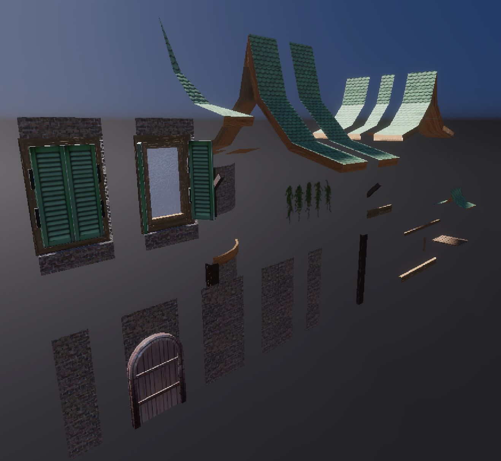
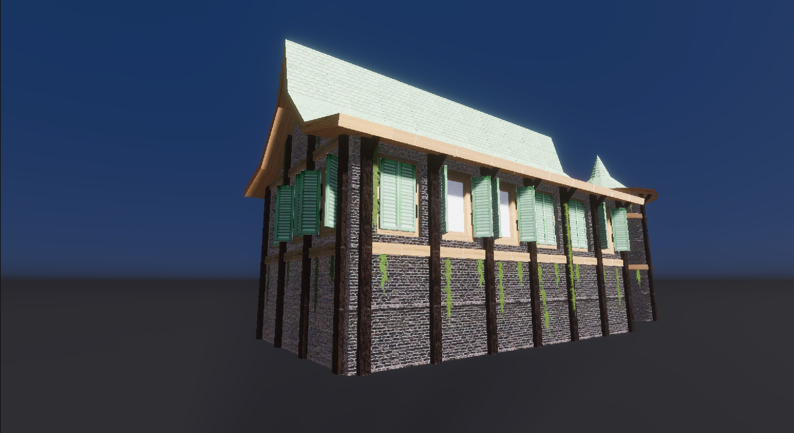

# Anvironment Art project
This is a Schoolproject where i made a 3D model of a gym. The objective is to use tilable textures and texture atlases to make kit to make the building. We also got a client brief and a lore guide. I started by searching for reference images and grayboxing.

I also made a textureplan and a kit layout plan.

Here is A showcase of the kit i made.

I used this kit to make the outside of the building.

